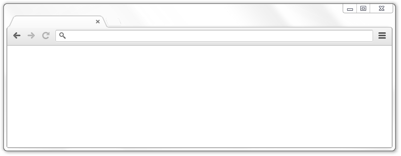
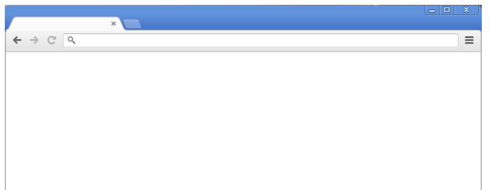

Silverfox was a Mozilla Firefox **115ESR** theme that mimicked the look and feel of 2012 Google Chrome (or Chromium). Silverfox's project name was derived from chrome's silver color.

### EOL

Silverfox was a simple hobby project that I did for my own nostalgia (2012 Chrome). I never expected so many people to use it. Even tho this project is going away, there is thankfully something **much better** that has been made over the time Silverfox released. The project (not being made by me) is called Geckium which has a **ton** of cool things developed for such as every era styling of Chrome (2008-2015), actual Chrome themes support in Firefox (a first), proper support for Windows & Linux and many more. 

[As a result, please use Geckium as your full on replacement.](https://github.com/angelbruni/Geckium)

### Original description features:
######  This project was not developed, approved or endorsed by Google!

#### Aero

######  *Supports native Aero on Windows 7 and Aero enabling software such as [DWMBlurGlass](https://github.com/Maplespe/DWMBlurGlass/) on Windows 10/11.
######  *Support for WindowBlinds is as-is and is not going to be worked on.

#### Classic Blue

######  *Classic Blue can be toggled on all platforms. On Windows 7 Aero Basic and Classic mode, Classic Blue is the only option.

#### Conditional Looks

###### ^ Native (GTK) theme. Linux only

###### ^ Chrome OS theme. Linux only

###### ^ Mac OS X native theme. Mac only

###### ^ Windows 8 native theme (follows Windows's accent color). Windows 8 only

###### ^ Windows 10/11 native theme. Windows 10/11 only

#### How to install Silverfox?

To setup Silverfox, please visit the [Silverfox Neocities site](https://silverfox.neocities.org/openbeta).

#### Silverfox Flags

Silverfox flags are settings you can toggle that tweak the look and feel of some Silverfox specific functions. You can access them either by navigating to about:flags, or by clicking the Hamburger/Wrench menu > Tools > Silverfox flags.

#### Join Silverfox server

Join the Discord server if you wish to be up to date on Silverfox status, new updates or if you have a bug to report.

#### Credits

To view the credits *(and some funny remarks)*, please visit the [Silverfox Neocities site](https://silverfox.neocities.org/components/credits).
